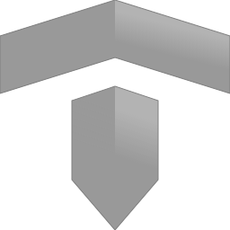

# Taoro

[![Contributors][contributors-shield]][contributors-url]
[![Forks][forks-shield]][forks-url]
[![Stargazers][stars-shield]][stars-url]
[![Issues][issues-shield]][issues-url]
[![MIT License][license-shield]][license-url]

<!-- PROJECT LOGO -->
<br />
<div align="center">
  <a href="https://github.com/AzazelN28/taoro">
    
  </a>

  <h3 align="center">Taoro</h3>

  <p align="center">
    A Open Source library for creating amazing games on the web
    <br />
    <a href="https://github.com/AzazelN28/taoro"><strong>Explore the docs »</strong></a>
    <br />
    <br />
    <a href="https://github.com/AzazelN28/taoro">View Demo</a>
    ·
    <a href="https://github.com/AzazelN28/taoro/issues">Report Bug</a>
    ·
    <a href="https://github.com/AzazelN28/taoro/issues">Request Feature</a>
  </p>
</div>

<!-- TABLE OF CONTENTS -->
<details>
  <summary>Table of Contents</summary>
  <ol>
    <li>
      <a href="#about-the-project">About The Project</a>
      <ul>
        <li><a href="#built-with">Built With</a></li>
      </ul>
    </li>
    <li>
      <a href="#getting-started">Getting Started</a>
      <ul>
        <li><a href="#prerequisites">Prerequisites</a></li>
        <li><a href="#installation">Installation</a></li>
      </ul>
    </li>
    <li><a href="#usage">Usage</a></li>
    <li><a href="#roadmap">Roadmap</a></li>
    <li><a href="#contributing">Contributing</a></li>
    <li><a href="#license">License</a></li>
    <li><a href="#contact">Contact</a></li>
    <li><a href="#acknowledgments">Acknowledgments</a></li>
  </ol>
</details>


## Why Taoro?

Taoro is an engine (and set of libraries) for developing web games. The main difference with other frameworks such as Phaser, Construct, etc. is in its 100% modular approach, allowing any user to rewrite any part of the engine. Simplicity first.

The other thing that I think makes Taoro quite unique is the way it implements ECS by using **generator functions** to create "tasks" that serve as glue between entities, components and systems while keeping the code simple and succinct.

Entities are just identifiers, Components are instantiated using those ids and Systems are started, stopped and updated by the core.

Example:

```javascript
export function * Player(game) {
  const transform = new TransformComponent('player')
  const image = new ImageComponent('player', {
    source: game.resources.get('player.png')
  })

  // ... initialize other components ...

  let health = 100

  // task main loop
  while (health > 0) {
    if (game.input.stateOf(0, 'up')) {
      transform.position.y--
    } else if (game.input.stateOf(0, 'down')) {
      transform.position.y++
    }

    // we use yield as a way to interrupt
    // the execution of this task and allow
    // other tasks and other systems to
    // be updated.
    yield
  }

  // when the task is over, we can consider the player
  // entity dead so we can release resources and update other things.

  // ... unregister components ...

  transform.unregister()
  image.unregister()
}

game.scheduler.add(Player(game))

// We can also pass ANY argument to our tasks because
// they're just functions...
game.scheduler.add(Enemy(game, EnemyType.HEAVY, x, y))
```

<p align="right">(<a href="#readme-top">back to top</a>)</p>

## Where does the name come from?

Taoro is the name of an old _menceyato_, a type of territorial division used by the natives of [Tenerife](https://es.wikipedia.org/wiki/Tenerife), one of the canary islands. The place where I grew up until I moved to Madrid.

<p align="right">(<a href="#readme-top">back to top</a>)</p>

## Previous works

This is heavily based on a previous (discontinued) project called [div.js](https://github.com/AzazelN28/div.js).

<p align="right">(<a href="#readme-top">back to top</a>)</p>

## Thanks

- To [zardoz89](https://github.com/Zardoz89/), [vii1](https://github.com/vii1/), [panreyes](https://github.com/panreyes/), [JaviCervera](https://github.com/JaviCervera), [Ferminho](https://github.com/ferminho) and all the people in the #canaldiv Discord server.

<p align="right">(<a href="#readme-top">back to top</a>)</p>

Made with :heart: by [AzazelN28](https://github.com/azazeln28)

<!-- MARKDOWN LINKS & IMAGES -->
<!-- https://www.markdownguide.org/basic-syntax/#reference-style-links -->
[contributors-shield]: https://img.shields.io/github/contributors/AzazelN28/taoro.svg?style=for-the-badge
[contributors-url]: https://github.com/AzazelN28/taoro/graphs/contributors
[forks-shield]: https://img.shields.io/github/forks/AzazelN28/taoro.svg?style=for-the-badge
[forks-url]: https://github.com/AzazelN28/taoro/network/members
[stars-shield]: https://img.shields.io/github/stars/AzazelN28/taoro.svg?style=for-the-badge
[stars-url]: https://github.com/AzazelN28/taoro/stargazers
[issues-shield]: https://img.shields.io/github/issues/AzazelN28/taoro.svg?style=for-the-badge
[issues-url]: https://github.com/AzazelN28/taoro/issues
[license-shield]: https://img.shields.io/github/license/AzazelN28/taoro.svg?style=for-the-badge
[license-url]: https://github.com/AzazelN28/taoro/blob/master/LICENSE.txt
[product-screenshot]: images/screenshot.png
[Next.js]: https://img.shields.io/badge/next.js-000000?style=for-the-badge&logo=nextdotjs&logoColor=white
[Next-url]: https://nextjs.org/
[React.js]: https://img.shields.io/badge/React-20232A?style=for-the-badge&logo=react&logoColor=61DAFB
[React-url]: https://reactjs.org/
[Vue.js]: https://img.shields.io/badge/Vue.js-35495E?style=for-the-badge&logo=vuedotjs&logoColor=4FC08D
[Vue-url]: https://vuejs.org/
[Angular.io]: https://img.shields.io/badge/Angular-DD0031?style=for-the-badge&logo=angular&logoColor=white
[Angular-url]: https://angular.io/
[Svelte.dev]: https://img.shields.io/badge/Svelte-4A4A55?style=for-the-badge&logo=svelte&logoColor=FF3E00
[Svelte-url]: https://svelte.dev/
[Laravel.com]: https://img.shields.io/badge/Laravel-FF2D20?style=for-the-badge&logo=laravel&logoColor=white
[Laravel-url]: https://laravel.com
[Bootstrap.com]: https://img.shields.io/badge/Bootstrap-563D7C?style=for-the-badge&logo=bootstrap&logoColor=white
[Bootstrap-url]: https://getbootstrap.com
[JQuery.com]: https://img.shields.io/badge/jQuery-0769AD?style=for-the-badge&logo=jquery&logoColor=white
[JQuery-url]: https://jquery.com
